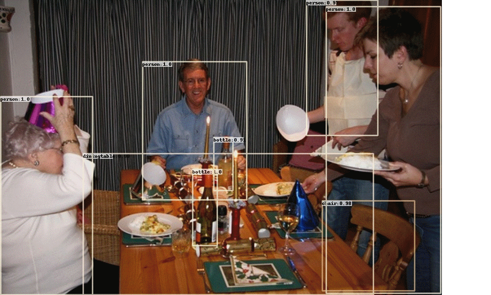
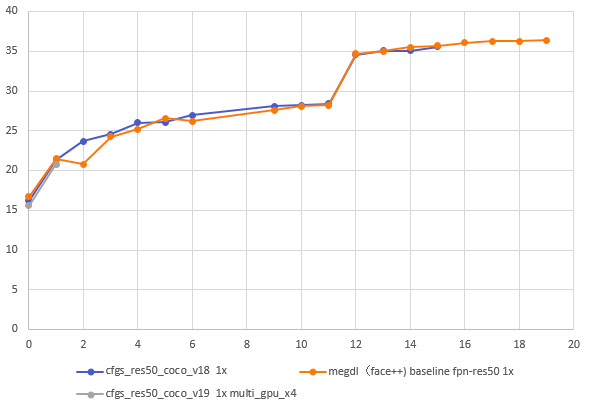
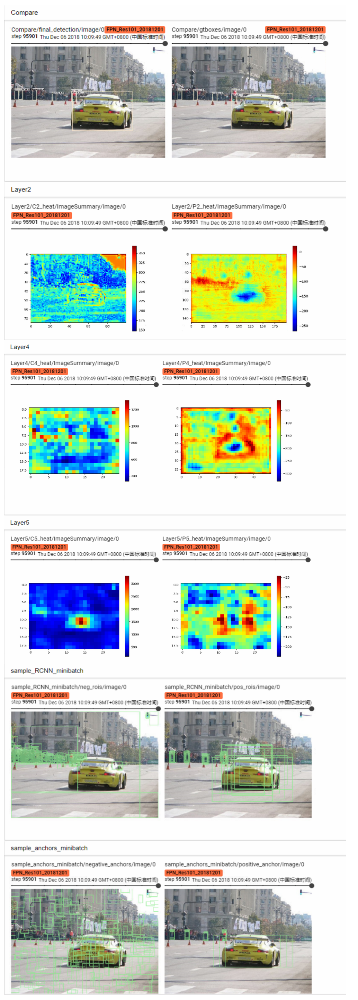
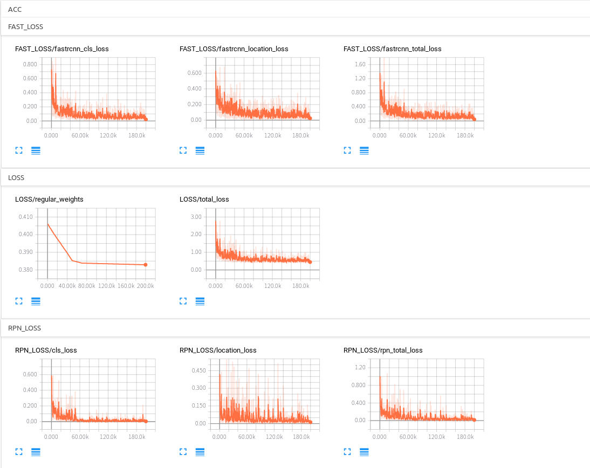

# Feature Pyramid Networks for Object Detection     

## Note
**A [development version](https://github.com/DetectionTeamUCAS/FPN_Tensorflow_DEV) based on FPN.**   
**Support multi-gpu training!**

## Abstract
This is a tensorflow re-implementation of [Feature Pyramid Networks for Object Detection](https://arxiv.org/abs/1612.03144).     

This project is based on [Faster-RCNN](https://github.com/DetectionTeamUCAS/Faster-RCNN_Tensorflow), and completed by [YangXue](https://github.com/yangxue0827) and [YangJirui](https://github.com/yangJirui).     

## Train on VOC 2007 trainval and test on VOC 2007 test (PS. This project also support coco training.)     


## Comparison
### use_voc2007_metric
| Models | mAP | sheep | horse | bicycle | bottle | cow | sofa | bus | dog | cat | person | train | diningtable | aeroplane | car | pottedplant | tvmonitor | chair | bird | boat  | motorbike |
|------------|:---:|:--:|:--:|:--:|:---:|:--:|:--:|:--:|:--:|:--:|:--:|:---:|:--:|:--:|:--:|:--:|:---:|:--:|:--:|:--:|:--:|
|[Faster-RCNN](https://github.com/DetectionTeamUCAS/Faster-RCNN_Tensorflow) resnet50_v1|73.09|72.11|85.63|77.74|55.82|81.19|67.34|82.44|85.66|87.34|77.49|79.13|62.65|76.54|84.01|47.90|74.13|50.09|76.81|60.34|77.47|
|[Faster-RCNN](https://github.com/DetectionTeamUCAS/Faster-RCNN_Tensorflow) resnet101_v1|74.63|76.35|86.18|79.87|58.73|83.4|74.75|80.03|85.4|86.55|78.24|76.07|70.89|78.52|86.26|47.80|76.34|52.14|78.06|58.90|78.04|
|[Faster-RCNN](https://github.com/DetectionTeamUCAS/Faster-RCNN_Tensorflow) mobilenet_v2|50.34|46.99|68.45|65.89|28.16|53.21|46.96|57.80|38.60|44.12|66.20|60.49|52.40|56.06|72.68|26.91|49.99|30.18|39.38|38.54|64.74|
|FPN resnet50_v1|74.26|73.27|82.23|82.99|61.27|80.59|72.73|81.37|85.26|84.76|80.33|77.43|65.31|79.18|85.78|46.47|73.10|55.99|76.11|59.80|81.19|  
|FPN resnet101_v1|76.14|74.63|85.13|81.67|63.79|82.43|77.83|83.07|86.45|85.82|81.08|81.01|71.22|80.01|86.30|48.05|73.89|56.99|78.33|62.91|82.24|
|FPN resnet101_v1+|75.71|74.83|83.55|82.47|65.49|77.85|71.74|80.98|86.61|87.14|81.02|77.76|71.26|79.82|86.78|51.64|77.45|56.12|79.44|60.55|81.69|    
|FPN resnet101_v1++|75.89|76.05|84.22|80.29|63.21|83.04|78.69|81.81|86.61|85.61|79.75|79.78|71.27|80.33|86.24|49.03|76.81|56.32|78.51|60.37|79.91|           

**+: SHARE_NET=False**    
**++: SHORT_SIDE_LEN=800, FAST_RCNN_MINIBATCH_SIZE=512**    

## COCO
|Model|Backbone|Train Schedule|GPU|Image/GPU|FP16|Box AP(Mask AP)|
|-----|--------|--------------|---|---------|----|---------------|
|Faster (ours)|R50v1-FPN|1X|1X TITAN Xp|1|no|36.1|
|Faster (ours)|R50v1-FPN|1X|4X TITAN Xp|1|no|36.1|
|Faster (Face++ & Detectron)|R50v1-FPN|1X|8X TITAN Xp|2|no|36.4|
|Faster (SimpleDet)|R50v1-FPN|1X|8X 1080Ti|2|no|36.5|

         

## My Development Environment
1、python3.5 (anaconda recommend)             
2、cuda9.0 **(If you want to use cuda8, please set CUDA9 = False in the cfgs.py file.)**                    
3、[opencv(cv2)](https://pypi.org/project/opencv-python/)    
4、[tfplot](https://github.com/wookayin/tensorflow-plot)             
5、tensorflow == 1.10                   

## Download Model
Please download [resnet50_v1](http://download.tensorflow.org/models/resnet_v1_50_2016_08_28.tar.gz)、[resnet101_v1](http://download.tensorflow.org/models/resnet_v1_101_2016_08_28.tar.gz) pre-trained models on Imagenet, put it to $PATH_ROOT/data/pretrained_weights.         

## Data Format
```
├── VOCdevkit
│   ├── VOCdevkit_train
│       ├── Annotation
│       ├── JPEGImages
│   ├── VOCdevkit_test
│       ├── Annotation
│       ├── JPEGImages
```

## Compile
```  
cd $PATH_ROOT/libs/box_utils/cython_utils
python setup.py build_ext --inplace
```

## Demo(available)

**Select a configuration file in the folder ($PATH_ROOT/libs/configs/) and copy its contents into cfgs.py, then download the corresponding [weights](https://github.com/DetectionTeamUCAS/Models/tree/master/FPN_Tensorflow).**      

```   
cd $PATH_ROOT/tools
python inference.py --data_dir='/PATH/TO/IMAGES/' 
                    --save_dir='/PATH/TO/SAVE/RESULTS/' 
                    --GPU='0'
```

## Eval
```  
cd $PATH_ROOT/tools
python eval.py --eval_imgs='/PATH/TO/IMAGES/'  
               --annotation_dir='/PATH/TO/TEST/ANNOTATION/'
               --GPU='0'
```

## Train

1、If you want to train your own data, please note:  
```     
(1) Modify parameters (such as CLASS_NUM, DATASET_NAME, VERSION, etc.) in $PATH_ROOT/libs/configs/cfgs.py
(2) Add category information in $PATH_ROOT/libs/label_name_dict/lable_dict.py     
(3) Add data_name to line 76 of $PATH_ROOT/data/io/read_tfrecord.py 
```     

2、make tfrecord
```  
cd $PATH_ROOT/data/io/  
python convert_data_to_tfrecord.py --VOC_dir='/PATH/TO/VOCdevkit/VOCdevkit_train/' 
                                   --xml_dir='Annotation'
                                   --image_dir='JPEGImages'
                                   --save_name='train' 
                                   --img_format='.jpg' 
                                   --dataset='pascal'
```     

3、train
```  
cd $PATH_ROOT/tools
python train.py
```

4、multi-gpu train
```  
cd $PATH_ROOT/tools
python multi_gpu_train.py
```

## Tensorboard
```  
cd $PATH_ROOT/output/summary
tensorboard --logdir=.
``` 



## Reference
1、https://github.com/endernewton/tf-faster-rcnn   
2、https://github.com/zengarden/light_head_rcnn   
3、https://github.com/tensorflow/models/tree/master/research/object_detection        
4、https://github.com/CharlesShang/FastMaskRCNN       
5、https://github.com/matterport/Mask_RCNN      
6、https://github.com/msracver/Deformable-ConvNets         
